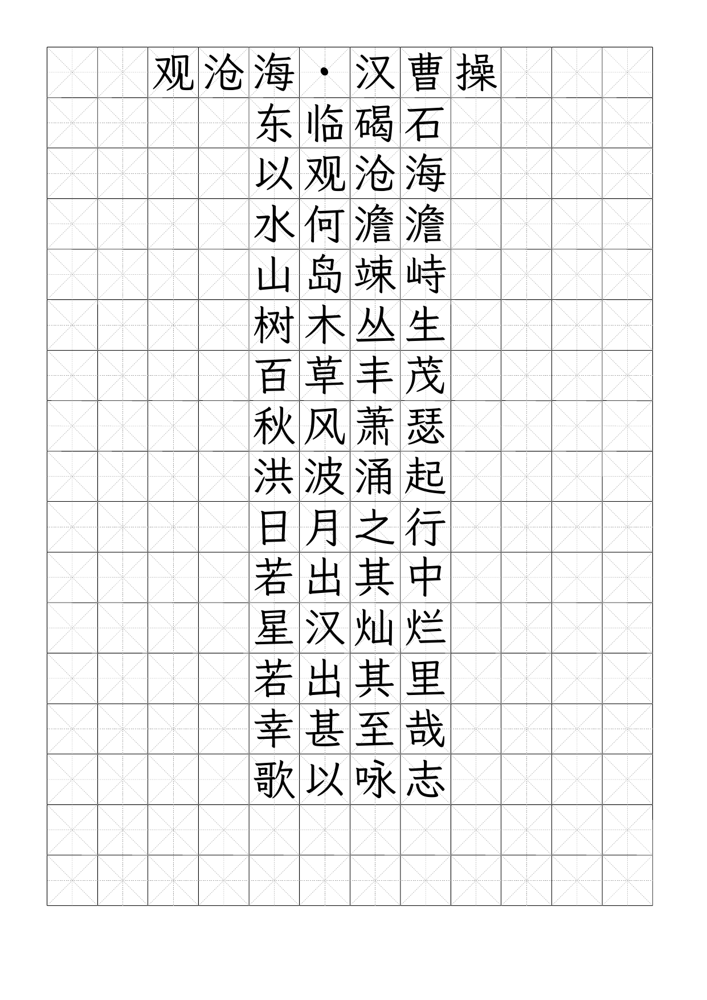

# 字帖生成器 · zitie

> Chinese calligraphy copybook generator —— 把任意中文内容一键生成 **A4 可打印 Word / PDF 字帖**
> （米字格 / 田字格、横排 / 竖排、描红 / 临写、任意字体、字体内嵌）。



> 上图由 `python3 zitie.py 观沧海.txt --font wenkai --title "观沧海·汉曹操" --order horizontal --pdf` 生成。

## 功能特性

- **内容随意换**：诗词、课文、生字、姓名……放进 txt，一条命令重新生成
- **多种格子**：米字格 / 田字格 / 方框 / 回宫格 / 九宫格 / 四线三格（拼音·英文）/ 控笔训练格（横线·竖线·斜线·圆圈·波浪）
- **A4 / A5 / B5**，横排（现代）/ 竖排（传统从右往左）
- **缺字检测**：生成前自动检查所选字体是否覆盖内容里的字，缺字提前警告，避免打印出方框
- **任意字体**：把 `.ttf` 放进 `fonts/` 即自动识别；田英章、庞中华等书家字体会**内嵌进 docx**，
  换电脑、发手机、去打印店都不回退字体
- **常用排版**：标题逐字占格且居中、正文按句居中、描红（浅灰范字）、每字重复、范字后留空临写
- **PDF 导出**：`--pdf` 调用 Word / LibreOffice 导出，直接打印最保险
- 单文件 Python 脚本，无需联网，没有 Word 也能生成 docx
- **完全本地运行**：不依赖任何大模型 / 云服务 / API key，`pip install` 后离线即可用

## 安装

需要 Python 3.9+：

```bash
pip install -r requirements.txt   # 只依赖 python-docx
```

可选（仅 `--pdf` 时需要）：Microsoft Word 或 LibreOffice（macOS：`brew install --cask libreoffice`）。

### 一键脚本（推荐，三平台通用）

脚本会自动装依赖、首次生成 `.env` 配置，然后按配置生成字帖：

- **Windows**：先装 [Python 3.9+](https://www.python.org/downloads/)（安装时**勾选 “Add Python to PATH”**），
  然后双击 **`zitie.bat`**；换内容可把 `.txt` 直接**拖到 `zitie.bat` 上**
- **macOS / Linux**：终端运行

  ```bash
  chmod +x zitie.sh      # 仅首次
  ./zitie.sh             # 生成 content.txt 的字帖
  ./zitie.sh 观沧海.txt    # 生成指定文件；也可把 .txt 拖到终端的脚本上
  ```

想改字体 / 标题 / 排版，编辑 `.env` 即可（见下文配置说明）。

## 快速开始

```bash
# 1. 把要练的内容写进 content.txt（或任意 .txt）
# 2. 生成
python3 zitie.py                          # 读 content.txt → 字帖.docx
python3 zitie.py "床前明月光"             # 内容也可以直接写在命令行

# 3. 打开 字帖.docx 打印（默认 A4、米字格、华文楷体 STKaiti）
```

标准横排字帖（标题在第一行、逐字占格、正文居中，最常见的练习册样式）：

```bash
python3 zitie.py content.txt --font wenkai --title "早发白帝城·李白" \
    --order horizontal --pdf
```

## 配置文件 `.env`（推荐）

不想每次敲一长串参数，可以把常用设置写进 `.env`，一次配好反复用：

```bash
cp .env.example .env        # macOS / Linux
copy .env.example .env      # Windows
```

然后用记事本 / 编辑器打开 `.env` 修改。可配置项（命令行参数会覆盖这里的值）：

| 配置项 | 含义 | 示例 |
| --- | --- | --- |
| `ZITIE_FONT` | 字体：`stkaiti` / `kaiti` / `wenkai`，或 `fonts/` 里的字体名关键词 | `wenkai` |
| `ZITIE_TITLE` | 标题（横排写在第一行居中；留空不要标题） | `观沧海·汉曹操` |
| `ZITIE_ORDER` | 排版：`horizontal` 横排 / `vertical` 竖排 | `horizontal` |
| `ZITIE_PAPER` | 纸张：`A4` / `A5` / `B5` | `A4` |
| `ZITIE_GRID_STYLE` | 格子：`mizi`/`tian`/`box`/`huigong` 回宫格/`jiugong` 九宫格/`pinyin` 四线三格/`kongbi` 控笔格 | `mizi` |
| `ZITIE_CELL` | 格子边长 mm（默认 15） | `15` |
| `ZITIE_MARGIN` | 页边距 mm | `14` |
| `ZITIE_CHAR_SCALE` | 字占格比例 0~1 | `0.85` |
| `ZITIE_PDF` | 是否同时导出 PDF：`true` / `false` | `true` |
| `ZITIE_OUTPUT` | 输出文件名 | `字帖.docx` |
| `ZITIE_FONTS_DIR` | 自定义字体目录（默认脚本下 `fonts/`） | `fonts` |
| `ZITIE_SOFFICE` | LibreOffice 路径（自动检测不到时手动指定） | `C:\Program Files\LibreOffice\program\soffice.exe` |

> `.env` 只保存在你本机，已被 `.gitignore` 忽略，不会上传；模板见 `.env.example`。

## 内容规则

- 默认按标点 / 换行分句：**竖排时一句占一列**（从右往左、从上到下，和传统字帖一致）；
  横排时一句占一行，整句居中，长句自动换行
- 标点默认不占格，加 `--keep-punct` 可保留
- 标题（`--title`）：横排时写在第一行、每个字也在格子里、整行居中；竖排时在左侧竖排

## 常用参数

| 参数 | 说明 | 默认 |
| --- | --- | --- |
| `--title "观沧海·曹操"` | 标题：横排写在第一行居中，竖排写在左侧 | 无 |
| `--cell 20` | 格子大小（mm），越大格子越大 | 15 |
| `--rows 7` | 每页行数（格子大小自动算，`--cols` 同理） | 自动 |
| `--order horizontal` | 横排（从左到右）；默认 `vertical` 竖排从右往左 | vertical |
| `--blanks 2` | 每个字后留几个空格，临写用 | 0 |
| `--repeat 3` | 每个字连续写几遍 | 1 |
| `--trace` | 浅灰色字，描红用 | 关 |
| `--grid-style jiugong` | `mizi` 米字格 / `tian` 田字格 / `box` 方框 / `huigong` 回宫格 / `jiugong` 九宫格 / `pinyin` 四线三格 / `kongbi` 控笔训练格 | mizi |
| `--font "楷体"` | 字体名或关键词（见下） | STKaiti |
| `--font-file xx.ttf` | 直接指定任意位置的字体文件（同样内嵌） | 无 |
| `--paper A5` | 纸张 A4 / A5 / B5 | A4 |
| `--orient landscape` | 纸张方向：`portrait` 纵向（默认）/ `landscape` 横向 | portrait |
| `--pen-color 808080` | 范字颜色（十六进制） | 黑色 |
| `--margin 12` | 页边距（mm） | 14 |
| `--char-scale 0.85` | 字占格子的比例 | 0.80 |
| `--pdf` | 同时导出可打印 PDF | 关 |

完整列表：`python3 zitie.py -h`

## 字体

```bash
python3 zitie.py --list-fonts           # 查看当前能用的所有字体
```

- **系统字体**：`--font stkaiti`（华文楷体，macOS 自带，默认）、`--font kaiti`（楷体，Windows 常用）
- **霞鹜文楷**：`--font wenkai`，已随项目附带（SIL OFL，免费可商用）
- **自己的字体**：把 `.ttf` / `.otf` / `.ttc` 放进 `fonts/`（详见 `fonts/README.md`），
  用文件名里的关键词即可选用，如 `--font "田英章硬笔楷书简体"`

> 书家字体生成的 `.docx` 会把字体**内嵌**（Word 标准 `.odttf` 机制），
> 无需安装字体、换电脑 / 发手机打印都不变字体；`--pdf` 导出的 PDF 最稳妥。

### 常用字帖字体推荐

**免费可商用**
- 霞鹜文楷 LXGW WenKai（`--font wenkai`，已随附）—— 清秀楷书，硬笔 / 毛笔皆宜，OFL 开源

**硬笔名家（个人练字可自行搜索下载，商用请购买授权）**
- 田英章 楷书 / 行楷 —— 硬笔楷书最主流，端正规范，入门首选
- 庞中华 楷书 —— 硬笔书法启蒙代表
- 司马彦 楷书 —— 中小学字帖常见
- 荆霄鹏 楷书 / 行楷、卢中南 楷书、吴玉生 行楷、顾仲安、丁永康

**毛笔经典碑帖风格**
- 欧体（欧阳询《九成宫》）、颜体（颜真卿《多宝塔》）、柳体（柳公权《玄秘塔》）、
  赵体（赵孟頫《胆巴碑》）、褚遂良《雁塔圣教序》

## 示例

```bash
# 大字版：每页 7 行，格子自动变大
python3 zitie.py content.txt --title "早发白帝城·李白" --rows 7 -o 大字版.docx

# 临写：每个范字后面留 2 个空格
python3 zitie.py content.txt --order horizontal --blanks 2 -o 临写.docx

# 描红：浅灰色字，照着笔画描写
python3 zitie.py content.txt --trace --repeat 2 -o 描红.docx

# 田英章横排 + PDF（字体内嵌，发打印店直接打印）
python3 zitie.py content.txt --font "田英章硬笔楷书简体" --title "观沧海·曹操" \
    --order horizontal --char-scale 0.85 --pdf

# 回宫格 / 九宫格
python3 zitie.py content.txt --order horizontal --grid-style huigong
python3 zitie.py content.txt --order horizontal --grid-style jiugong

# 控笔训练格（无需内容，纯运笔练习：横线/竖线/斜线/圆圈/波浪）
python3 zitie.py x --grid-style kongbi --pdf

# 四线三格：拼音 / 英文字母（内容直接写字母，可带声调）
python3 zitie.py pinyin.txt --grid-style pinyin --order horizontal --cell 12
```

## 说明与平台

- 在 macOS 上测试：Word for Mac 打开内嵌字体 docx 显示正确；PDF 导出优先调用 Word，
  无 Word 时自动回退 LibreOffice
- Windows 上：系统楷体可直接用；书家字体建议用 `--font-file` 指向字体文件以便内嵌
- 生成的 `.docx` 用 Word / WPS 均可打开

## 常见问题 FAQ

**需要联网或大模型 API key 吗？**
不需要。完全本地运行，不调用任何 AI / 云服务，`pip install` 后离线可用；唯一第三方库是 `python-docx`。

**Windows 双击 `zitie.bat` 闪退 / 提示找不到 python？**
Python 没装好或没加入 PATH。重装 [Python](https://www.python.org/downloads/)，安装时**勾选 “Add Python to PATH”**，
装完重开一个窗口再双击。也可以把 `.txt` 拖到 `zitie.bat` 上生成。

**macOS 运行 `./zitie.sh` 提示找不到 python3 / 没权限？**
装 Python：`brew install python`（或官网安装包）。首次先执行一次 `chmod +x zitie.sh` 再运行。
也可以不用脚本，直接 `python3 zitie.py content.txt --pdf`。

**Linux 怎么装依赖？**
`sudo apt install python3 python3-pip`（Ubuntu/Debian），然后 `./zitie.sh` 或 `python3 zitie.py`。

**怎么换练习内容 / 标题 / 格子大小？**
换内容：改 `content.txt` 或传入任意 txt；标题 / 字体 / 排版：编辑 `.env`，
或命令行加 `--title "标题"`、`--cell 18`、`--rows 10 --cols 10`。

**一页多少行、一行多少字？**
默认按格子大小自动算（A4、15mm 格约 16 行 × 12 字）。想固定就用 `--rows 行数 --cols 字数`，格子大小会自动适配。

**生成的字不是我选的字体 / 打开后字体变了？**
书家字体要先把 `.ttf` 放进 `fonts/`，并用 `--font 字体名关键词` 选择；
Word 打开若仍回退字体，直接用 `--pdf` 导出的 PDF 打印最稳（字体已内嵌）。

**没有生成 PDF？**
导出 PDF 需要安装 Word 或 [LibreOffice](https://zh-cn.libreoffice.org/download/)；不装也会正常生成 `.docx`。
Windows 装了 LibreOffice 仍找不到时，在 `.env` 里设置
`ZITIE_SOFFICE=C:\Program Files\LibreOffice\program\soffice.exe`。

**田英章 / 庞中华这些字体能用吗？收费吗？**
个人练字：自行搜索下载 `.ttf` 放进 `fonts/` 即可，脚本会自动识别并内嵌。
这些多为商业字体，**商用 / 公开发布需购买授权**；项目本身不附带它们。免费可商用首选随附的霞鹜文楷（`--font wenkai`）。

**`.env` 会不会被上传 / 泄露？**
不会。`.env` 已在 `.gitignore` 中，只保存在本机；仓库里只有不含敏感信息的模板 `.env.example`。

## 贡献

欢迎 issue / PR：新字体适配、更多排版样式（回宫格、控笔训练等）、Windows 兼容性、更多纸张尺寸……

## License

- 代码：[MIT License](LICENSE)
- 随附字体 `fonts/LXGWWenKai-Regular.ttf`（霞鹜文楷）：[SIL Open Font License 1.1](fonts/OFL-LXGW-WenKai.txt)
- `fonts/` 中其他字体由使用者自行提供，请确认授权（见 `fonts/README.md`）
